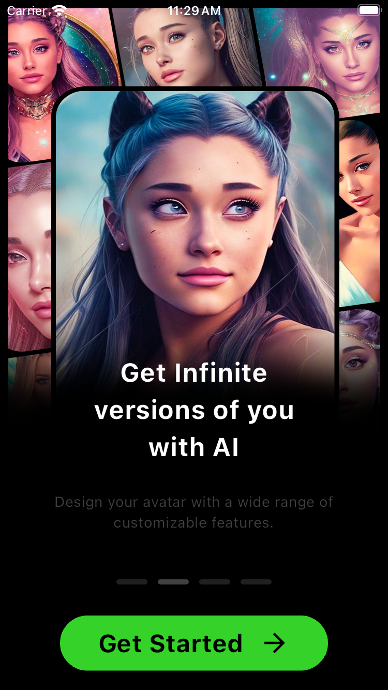

# AlArtAvatar

AlArtAvatar, kullanıcıların çeşitli resimleri görüntüleyebileceği bir yapay zeka destekli uygulamadır. Bu uygulama, metin girdisini alır ve bu metni bir görüntüye dönüştürür.

 [stability.ai](https://stability.ai/) Bu baglantıdan mail ile kayıt olarak ücretsiz 25 adet hak alabilirsiniz
## Kullanılan Teknolojiler

- Bloc
- Http
- sharedPreferences
- hive
- webview

          
 
 
 
 

